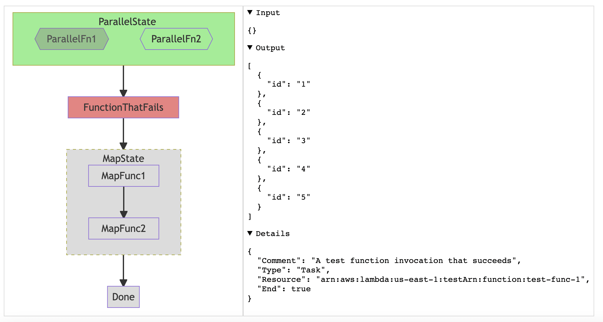

# stepfunction-visualizer

A toolkit to debug and visualize [local AWS step functions](https://docs.aws.amazon.com/step-functions/latest/dg/sfn-local.html)



To use, first you need to set up local step functions. If you are using the serverless framework, I recommend using the [serverless-step-functions-local package](https://www.npmjs.com/package/serverless-step-functions-local) and following the advice in this [blog post](https://medium.com/atheneum-partners-digitalization/how-to-run-serverless-step-functions-offline-26b7b994d2b5).

Once you have local step functions running at localhost:8083 (the default port), run the steps below to launch a server that shows all the local step functions and their executions, with flowcharts.

## Running the server

Install dependencies with `npm install` and then start the development server:

```sh
npm run dev
```

If all succeeds, you will be able to see the web application locally at http://localhost:3000.

### Technology used

- [TypeScript](https://www.typescriptlang.org/): to model Amazon States Language (ASL) and data structures used in the CLI
- [SvelteKit](https://kit.svelte.dev/): the web server (with Svelte for components)
- [Mermaid](https://github.com/mermaid-js/mermaid): for flowcharts/diagramming
